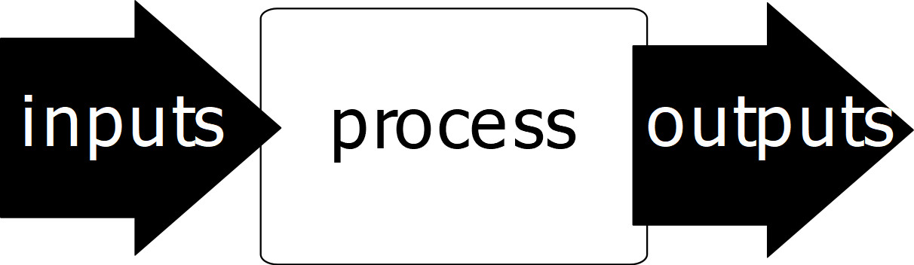

<head>

   <meta property="og:title" src="">

</head>

## 自序

作者其實是程式設計專業的學生，本身學習程式設計已經多年，本身並非以投資專業，有感於市面上的投資學教科書在編排方面大多雷同，並多半以投資相關科系學生為對象，在用字遣詞方面艱深難懂，數學公式也不能凸顯出投資的主要意涵與概念，使初學者對於投資當作一門艱深的科目，錯失所謂投資大好機會，避之唯恐不及。

<head>

   <meta property="og:title" src="">

</head>

## 自序

作者其實是程式設計專業的學生，本身學習程式設計已經多年，本身並非以投資專業，有感於市面上的投資學教科書在編排方面大多雷同，並多半以投資相關科系學生為對象，在用字遣詞方面艱深難懂，數學公式也不能凸顯出投資的主要意涵與概念，使初學者對於投資當作一門艱深的科目，錯失所謂投資大好機會，避之唯恐不及。

投資，是一門生活的科目、也是藝術，它不單單只局限於所謂的有價投資，乃至於追尋人生目標、詳盡規劃並且行動等等，皆為投資的範疇。只要你身為一個健全的個體，是一門必定要學習的課程。本書也包含了數學、管理、人際關係、人力資源、行銷等等範疇，詳細的去推導出投資真正的動機與目的。如果沒有學好投資的概念，想必在做決策時必定會受到許多主觀的判斷影響，進而無法選擇合理有效的決斷。

問題是：市面上的投資學書籍，多半講的是理論部分，大部分延用的都是以前大師級學者論文等級的文章所改寫成的書籍，論述學者們在論文裡提到的計算公式，並淺談每一項有價金融投資工具理論及用途，而且章節多半雷同，使多半數的學生們知其然卻不知其所以然，若投資學成為了專業人士論述的天堂，卻成為了初學者的夢魘時，要增強投資學的實力與基礎，便如同緣木求魚一般。

該如何增加其學習的成就感，並將其觀念訴諸於文字，便是本書最需要克服的理念與訴諸的內涵，也因為同學、親朋好友的需求，激起我寫出這本淺顯易懂投資學的念頭。

本書大約劃分為XXX章節。前XX章節以講解投資原理動機為目的，並以社會、物理科學等基礎簡單動機表明投資的意涵為主，後段章節將講解到投資最重要的實務以及面臨到的問題解惑，並帶入前面章節所提示到的投資動因，深入探討投資實際狀況。在閱讀前幾章節之後，想必初學者對於投資這塊必定有基本的了解。

為使讀者能夠更加的了解比較艱深易懂的詞彙，本書每個章節會對學習的目標做說明。提示這個章節該學習的重點。文中比較重要的觀念與特有名詞，都會在旁另作重點提示，以方便記憶。

本書得以問世，首先我得感謝我的會計班的師生，人若不從身旁的人領教知識，必然是全世界最愚笨的人。也特別感謝教導我創作的資訊班同學們提供寫書意見，也感謝家人的支持，使我能心無旁鶩認真完成作品。最後，本書若有疏漏錯誤、得罪他人之處，均由本人承擔，期望各位不吝賜教，感激不盡。

## CHAPTER 1

### 什麼是投資？

在本書的開始，我們要先定義什麼是投資？我們可以先看一下這一篇故事：

> 「嗨咻!嗨咻!」
夏天，火傘般的太陽高高地掛在天空，地面上被照得熱呼呼的，令人喘不過氣來。
可是，螞蟻們仍然勤勞地在工作。
牠們使出全身力氣，合力搬著一塊美味的食物，準備帶回地下的家裏貯存起來。
「哦!快到了，忍耐一下子，嗨咻!」
螞蟻們好不容易把東西搬進草叢裏，正準備繼續搬回家時，突然，蟋蟀的聲音從草根下傳過來:「喂喂!小螞蟻!你們為什麼老是這麼忙呢?夏天這麼熱，應該好好玩一玩嘛!」
「不行喔!現在正是工作的好時候，怎麼能玩呢?」
「夏天裏，應該努力貯存一些食物。到了冬天，就找不到食物呀!」
螞蟻一面說，一面還是不停地工作。
「嘿!現在就為冬天的事操心呀!哼!傻瓜，我才不想那麼久以後的事呢!我要利用這個夏天，好好玩個痛快!你們就繼續工作吧!傻瓜!」
蟋蟀說完，便飛走了。
可是，螞蟻們還是默默地工作著。
轉眼間，炎熱的夏天過去了。
接著，黃葉飛舞的秋天也過去了。
寒冷的冬天終於來了，刺骨的北風天天「呼呼」地吹著。
可是，儘管北風再冷，也吹不到勤勞的螞蟻。
因為，牠們在夏天時，已經準備了許多過冬的食物，現在正舒舒服服地躲在溫暖的家裏呢!
有一天，螞蟻們突然聽到一陣微弱的敲門聲。
「螞蟻啊!螞蟻!請你們開開門!」
「唉呀!是誰呢?」
螞蟻打開門一看，發現一隻瘦巴巴的蟋蟀孤零零地站在門外。
「哦!你是夏天那隻蟋蟀嘛!」
是啊!牠正是夏天在草叢裏嘲笑螞蟻的那隻蟋蟀。
可是，那時候牠身上所穿的藍色漂亮衣服，現在，已經變成灰色，而且一副髒兮兮的樣子，好可憐。
「螞蟻啊!我快要餓死了，請你給我一點食物吧!」
「好啊!沒問題。」
螞蟻們和藹可親地請蟋蟀進入溫暖的屋內，讓牠盡量吃個飽。
「哇!螞蟻啊!你們真偉大，夏天勤勞地工作，冬天才能過這種舒服的日子……….，相反的，我夏天那麼貪玩，所以，冬天才會吃盡苦頭。」
蟋蟀感到很後悔。

想必大家都有看過這則故事，這是經典的螞蟻與蟋蟀的伊索寓言。

這篇故事講的其實就是投資的故事。
我們辛苦的工作，以時間和勞力換取金錢，目的就是為了讓自己過上好的生活。而投資的定義，我會這樣認為：

<b>遞延現在使用金錢的可能，來換取未來更多的金錢的價值。</b>

當然，這裡指的不只是金錢，也有可能是其他任何你覺得可以投資的東西。

### 如何累積財富

如何才能累積到100億的財富？大家都說第一個100萬是最難賺的，之後賺錢就變得容易多了。某種程度來看的確如此，賺錢的確會越來越容易，而且速度也會越來越快，想想看我們的台股，從10000點回升到11000點的速度遠比從3000點上升到4000點還得更慢了許多。

隨著基數越來越大，到達下一個數字的百分比會越來越小，它不像是打棒球那樣，就算你累積450個全壘打，最後50個全壘打和最早的50個全壘打其實是相同的。對我來說，財務知識的累積就像一隻金牛，讓你想不賺錢都難。

## 你需要一點數學

#### 什麼是平均數？代表的意義是什麼？

在股票世界裡，時常用到平均數的概念。移動平均線、指數平均線以其其他衍生出來的概念，而這類的平均線大部分都不能完整地去表示

>1950年，美國空軍的研究人員在測量了4063多名飛行員的身體各個部分的尺寸後，為飛行員的身材計算出了各個部位的平均值，並以此數據作為「標準飛行員」來設計駕駛艙。他們相信，這能造出適合大多數飛行員身形的駕駛艙。

>但最終結果表明，在4063名飛行員中，沒有一位飛行員的身材，是完全符合設計出來的駕駛艙的，沒有誰的身材與「標準飛行員」相符。

>研究人員還發現，如果只選擇三個部位進行比較，例如頸圍、大腿圍、腕圍，那麼只有3.5%的飛行員在這三個維度符合平均尺寸。

><b>而結論就是，根本就沒有標準飛行員，如果為標準飛行員設計駕駛艙，那麼這個駕駛艙就不會適用於任何人。</b>

人的理性像水一樣脆弱，你只要輕輕一拍，就能擾動它的形狀，有研究表示，你只要略施小計，說出某句指定的話，就能影響他人的理性

#### 有了平均數，代表什麼都不是

####

## 投資是什麼？

## 關於成長率

## 成長率的逆向思維

## 投資與人生規劃

## 最簡單的一條公式

## 報告總教練！我想打籃球！

## 什麼時候開始投資？

關於這個問題，有許多人就會經常性的問：我們到底該在什麼時候開始投資呢？

我會直接且了當地回答：

##### 打從你娘胎出生之前就該開始投資了

當然，這是一句玩笑話，如果你現在還沒開始投資的話，最棒的投資點永遠都是<b>現在</b>。

## 知識的積累

## 策略

## 你的目標是什麼？

## 規劃

## 審度局勢

## 最佳效率前緣

## 有價投資商品

## 利率

利率是虛擬的概念，

## 風險

#### 什麼是風險？

#### 風險與損失

#### 買彩券是一個好的投資嗎？

#### 投資？投機？賭博？ 為什麼會有三分法？一次說清楚

# 學習的論點

## 記憶的效率前緣

為什麼有些人學習的力道特別的強，卻有些人每天學習了8個小時，都覺得好像徒勞無功，其實問題的答案在於：

<b style="font-size:18px;">學習的深淺度</b>

那麼我們開始用5W1H來開始分析這項問題：

- 什麼是學習的深淺度呢？

- 如何提升學習的深淺度？有什麼樣的手段？

- 學習的深淺度有什麼時間限制嗎？

- 學習的深淺度在地點上有什麼限制嗎？

在開始講解之前，我會先說一個最經典的故事：

> 馬克斯 普朗克（Max Planck）於1918年榮獲諾貝爾物理學獎，之後他在全德國作巡迴報告。不管被邀請到哪裡，他都會就新的量子力學演講一番。他的司機漸漸對他的報告爛熟於心。「普朗克教授，老作同樣的報告，你一定覺得無聊。我建議，在慕尼黑由我代你作報告，你坐最前排，戴上我的司機帽。讓咱倆換換花樣。」普朗克興致盎然，欣然同意。於是司機為一群專家級聽眾作了一番有關量子力學的長篇報告。之後，一位物理學教授舉手提問。司機回答說：「我壓根兒沒想到，在慕尼黑這樣先進的城市裡還會有人提出這麼簡單的問題。請我的司機來回答這個問題吧。」

在這篇文章中我們可以了解到，這位老司機就算已經背熟了他的量子學演講的內容，但是面對其他物理學家的問題，司機是絕對不可能回答得出來的，這就是我們在這章節所提到的學習深淺的問題，他只是單純的像錄音機一樣，把他所重複聽到的聲音，再全部的重複播放一遍而已。然而，記得只是最基本的層次，這一類的學習只是單純的輸入輸出，完全不對內容進行任何有效的思考，更別說任何有效率的思考了。

如果是在電腦科學的範疇，他就只是最簡單，電腦在做的最基本雛形，如下圖:

而中間的處理過程(Process)就只是單純的重複輸入(Input)所傳進來的資料，直接丟給了輸出(Output)，完全沒有做任何的知識上的加工。這樣的知識是顯得薄弱而且容易取代的，而且電腦還做得比人類更好(畢竟電腦就是為此而生的。)

這樣的知識是最淺層的知識處理，不管我們是在期末考前才開始看書，亦或是補習班中的填鴨式教育，我們都是因為要應付考試才得到的知識都屬於此類範疇，而大部分的人就這樣錯過了學習的本質。

學習投資財經知識也是如此，我們總是想要用最簡單最基本的事物，來去做衡量一件事物發生的原因，只利用價格與成交量指標，就能夠賺更多的錢！一個技術分析指標就能把股市當提款機。然而這又造成了一個知識的誤區：

> - 這類的投資者可能是<b>有經驗的</b>。是學習過大量的知識，將知識去蕪存菁後所得到的知識，雖然有一個明確的主體投資方式，但成功還是得靠大量練習所練出來的直覺。

> - <b>完全的運氣使然</b>，有些投資者只是單純的了解前人投資者的皮毛，照其步驟做投資行為，正好順應著市場賺到一筆可觀利益。然而1000個人做投資或許有10個人可以賺到錢，而剛好有1位出了一本書，我們所崇拜的成功人士也許只是如此而已。

<b>那為什麼我們現在的學習方式到現在都還沒做任何改變呢？</b>

答案是因為：<b>方便</b>

人們做的任何一件事都需要消耗成本與注意力的，尤其是政府機關教育機構如果要大量篩選人們是否達成最基本的學習門檻時，必須找到一個合乎經濟效益，簡單直接的方式：考試測驗，這樣的方法可以既可以快速篩選，也能還蓋大部分的學生的學習狀態。

我們可以參考一個故事：

> 在天龍國有一個擲硬幣遊戲，它是站在一個定點，然後把硬幣往牆壁上丟，越接近牆壁者就是勝者。於是這個國家舉辦了一個擲硬幣比賽，許多的科學家合作把場地設置成隨便丟都能夠靠牆壁的場地，所以勝利完全是靠機率。

> 這次參賽總共有100萬人，10人一組。第一次投擲，總共產生了10萬人冠軍。第二次比賽，只剩1萬人，到了第五次，總共產生了10位世界冠軍。他們每個人得冠軍的機率為0.00001。

> 他們得到冠軍之後便欣喜若狂，無論如何都要分享他們的喜悅與成就。於是決定出書。<<靠K線賺大錢>>，<<看懂K線你也會贏>>，<<開始把股票當成提款機，K線投資法>>，這幾本書瞬間在天龍國成為暢銷書，冠軍也開始準備著世界巡迴演講，分享他們如何成為冠軍。

這一個故事所要表達的事情就是：並不是所有的知識點都是可以確切的照本宣科的進行，單純的學會皮毛的部分，不能夠幫助你學習到知識的根源。

<b>那我們該如何加深我們學習的深度呢？</b>

#### 反覆的重讀與大腦的提取

有些人對於學習會提供這樣的意見：只要進行反覆、反覆、再反覆的練習，就能夠熟能生巧了。如果有點知識的人就會跟你說一萬個小時對吧？!但是就算花費一萬個小時，就真的就能夠更加精通了嗎？

很多人都會誤以為，當你想要記住一些知識的時候，只要反覆閱讀就能夠將那些內容記到腦海裡，想要記住這資料，就必須花費一整天來看這份資料。

但其實，反覆的重讀並不會增加記憶力的深度：

> 美國科學家有做了一個研究，他們找來了兩所不同大學的學生，並要求他們閱讀科學雜誌的不同段落，這些學生們又分成了兩組，一組只讀一遍，另一組反覆閱讀了好幾次。

> 過了幾天後，研究員再找回那些學生來測試他們的學習效果，結果卻讓人跌破眼鏡，每一位的學生成績幾乎一模一樣。

既然重複閱讀並沒有太大的作用，我們就來反思：可以用哪些做法增加記憶固化程度呢？

我們來看看這一篇文章：

> 接下來我們改變了實驗的做法：
> 我們讓學生分成了三組，並讓他們閱讀兩篇不同的文章，並分成三組：
> - 第一組學生重複閱讀文章好幾遍。
> - 第二組學生閱讀文章三遍後，要求在白紙上寫下自己記住的內容。
> - 第三組學生只能用5分鐘閱讀文章一遍，接下來進行三次的白紙上寫下自己記住的內容，之後在新的白紙上回憶內容再寫一次，反覆三遍。

> 剛開始，第一組的記憶力成績是最好的，能夠記得最多內容。
> 有趣的是，一個禮拜後，研究員找回學生，問他們記得多少內容，結果反而逆轉，第三組的學生卻能夠記得最多內容，遺忘程度大幅降低。

結果令人震驚！原來只要簡單的做回憶的動作(此例子是在白紙上寫下剛剛記住的內容)比花時間重複閱讀效果更好！
後續也有其他的研究去支持這個理論，如果我們在加上"時間"與"難度"，是否能提高記憶呢？

如果你有看過Barbara Oakley的公開課程，你就能瞭解其學習的方式。以下是他學習的方法：

#### 反覆閱讀真的夠力嗎？

#### 如何在記憶上提升？

#### 報告將軍！我從機器人學到如何學習了！

投資，是一門生活的科目、也是藝術，它不單單只局限於所謂的有價投資，乃至於追尋人生目標、詳盡規劃並且行動等等，皆為投資的範疇。只要你身為一個健全的個體，是一門必定要學習的課程。本書也包含了數學、管理、人際關係、人力資源、行銷等等範疇，詳細的去推導出投資真正的動機與目的。如果沒有學好投資的概念，想必在做決策時必定會受到許多主觀的判斷影響，進而無法選擇合理有效的決斷。

問題是：市面上的投資學書籍，多半講的是理論部分，大部分延用的都是以前大師級學者論文等級的文章所改寫成的書籍，論述學者們在論文裡提到的計算公式，並淺談每一項有價金融投資工具理論及用途，而且章節多半雷同，使多半數的學生們知其然卻不知其所以然，若投資學成為了專業人士論述的天堂，卻成為了初學者的夢魘時，要增強投資學的實力與基礎，便如同緣木求魚一般。

該如何增加其學習的成就感，並將其觀念訴諸於文字，便是本書最需要克服的理念與訴諸的內涵，也因為同學、親朋好友的需求，激起我寫出這本淺顯易懂投資學的念頭。

本書大約劃分為XXX章節。前XX章節以講解投資原理動機為目的，並以社會、物理科學等基礎簡單動機表明投資的意涵為主，後段章節將講解到投資最重要的實務以及面臨到的問題解惑，並帶入前面章節所提示到的投資動因，深入探討投資實際狀況。在閱讀前幾章節之後，想必初學者對於投資這塊必定有基本的了解。

為使讀者能夠更加的了解比較艱深易懂的詞彙，本書每個章節會對學習的目標做說明。提示這個章節該學習的重點。文中比較重要的觀念與特有名詞，都會在旁另作重點提示，以方便記憶。

本書得以問世，首先我得感謝我的會計班的師生，人若不從身旁的人領教知識，必然是全世界最愚笨的人。也特別感謝教導我創作的資訊班同學們提供寫書意見，也感謝家人的支持，使我能心無旁鶩認真完成作品。最後，本書若有疏漏錯誤、得罪他人之處，均由本人承擔，期望各位不吝賜教，感激不盡。

　　　　　　　　　　　　　　　　　　　　　　　　　　　　　　　　　　　　　　　　　　　　　　　　　　　　　　   

                                                         

                                                         

## CHAPTER 1

### 如何累積財富

如何才能累積到100億的財富？大家都說第一個100萬是最難賺的，之後賺錢就變得容易多了。某種程度來看的確如此，賺錢的確會越來越容易，而且速度也會越來越快，想想看我們的台股，從10000點回升到11000點的速度遠比從3000點上升到4000點還得更慢了許多。

隨著基數越來越大，到達下一個數字的百分比會越來越小，它不像是打棒球那樣，就算你累積450個全壘打，最後50個全壘打和最早的50個全壘打其實是相同的。對我來說，財務知識的累積就像一隻金牛，讓你想不賺錢都難。

## 你需要一點數學

#### 什麼是平均數？代表的意義是什麼？

在股票世界裡，時常用到平均數的概念。移動平均線、指數平均線以其其他衍生出來的概念，而這類的平均線大部分都不能完整地去表示

>1950年，美國空軍的研究人員在測量了4063多名飛行員的身體各個部分的尺寸後，為飛行員的身材計算出了各個部位的平均值，並以此數據作為「標準飛行員」來設計駕駛艙。他們相信，這能造出適合大多數飛行員身形的駕駛艙。

>但最終結果表明，在4063名飛行員中，沒有一位飛行員的身材，是完全符合設計出來的駕駛艙的，沒有誰的身材與「標準飛行員」相符。

>研究人員還發現，如果只選擇三個部位進行比較，例如頸圍、大腿圍、腕圍，那麼只有3.5%的飛行員在這三個維度符合平均尺寸。

><b>而結論就是，根本就沒有標準飛行員，如果為標準飛行員設計駕駛艙，那麼這個駕駛艙就不會適用於任何人。</b>

人的理性像水一樣脆弱，你只要輕輕一拍，就能擾動它的形狀，有研究表示，你只要略施小計，說出某句指定的話，就能影響他人的理性

#### 有了平均數，代表什麼都不是

####

## 投資是什麼？

## 關於成長率

## 成長率的逆向思維

## 投資與人生規劃

## 最簡單的一條公式

## 報告總教練！我想打籃球！

## 什麼時候開始投資？

關於這個問題，有許多人就會經常性的問：我們到底該在什麼時候開始投資呢？

我會直接且了當地回答：

##### 打從你娘胎出生之前就該開始投資了

當然，這是一句玩笑話，如果你現在還沒開始投資的話，最棒的投資點永遠都是<b>現在</b>。

## 知識的積累

## 策略

## 你的目標是什麼？

## 規劃

## 審度局勢

## 最佳效率前緣

## 有價投資商品

## 利率

利率是虛擬的概念，

## 風險

#### 什麼是風險？

#### 風險與損失

#### 買彩券是一個好的投資嗎？

#### 投資？投機？賭博？ 為什麼會有三分法？一次說清楚

# 學習的論點

## 記憶的效率前緣

為什麼有些人學習的力道特別的強，卻有些人每天學習了8個小時，都覺得好像徒勞無功，其實問題的答案在於：

<b style="font-size:18px;">學習的深淺度</b>

那麼我們開始用5W1H來開始分析這項問題：

- 什麼是學習的深淺度呢？

- 如何提升學習的深淺度？有什麼樣的手段？

- 學習的深淺度有什麼時間限制嗎？

- 學習的深淺度在地點上有什麼限制嗎？

在開始講解之前，我會先說一個最經典的故事：

> 馬克斯 普朗克（Max Planck）於1918年榮獲諾貝爾物理學獎，之後他在全德國作巡迴報告。不管被邀請到哪裡，他都會就新的量子力學演講一番。他的司機漸漸對他的報告爛熟於心。「普朗克教授，老作同樣的報告，你一定覺得無聊。我建議，在慕尼黑由我代你作報告，你坐最前排，戴上我的司機帽。讓咱倆換換花樣。」普朗克興致盎然，欣然同意。於是司機為一群專家級聽眾作了一番有關量子力學的長篇報告。之後，一位物理學教授舉手提問。司機回答說：「我壓根兒沒想到，在慕尼黑這樣先進的城市裡還會有人提出這麼簡單的問題。請我的司機來回答這個問題吧。」

在這篇文章中我們可以了解到，這位老司機就算已經背熟了他的量子學演講的內容，但是面對其他物理學家的問題，司機是絕對不可能回答得出來的，這就是我們在這章節所提到的學習深淺的問題，他只是單純的像錄音機一樣，把他所重複聽到的聲音，再全部的重複播放一遍而已。然而，記得只是最基本的層次，這一類的學習只是單純的輸入輸出，完全不對內容進行任何有效的思考，更別說任何有效率的思考了。

如果是在電腦科學的範疇，他就只是最簡單，電腦在做的最基本雛形，如下圖:

而中間的處理過程(Process)就只是單純的重複輸入(Input)所傳進來的資料，直接丟給了輸出(Output)，完全沒有做任何的知識上的加工。這樣的知識是顯得薄弱而且容易取代的，而且電腦還做得比人類更好(畢竟電腦就是為此而生的。)

這樣的知識是最淺層的知識處理，不管我們是在期末考前才開始看書，亦或是補習班中的填鴨式教育，我們都是因為要應付考試才得到的知識都屬於此類範疇，而大部分的人就這樣錯過了學習的本質。

學習投資財經知識也是如此，我們總是想要用最簡單最基本的事物，來去做衡量一件事物發生的原因，只利用價格與成交量指標，就能夠賺更多的錢！一個技術分析指標就能把股市當提款機。然而這又造成了一個知識的誤區：

> - 這類的投資者可能是<b>有經驗的</b>。是學習過大量的知識，將知識去蕪存菁後所得到的知識，雖然有一個明確的主體投資方式，但成功還是得靠大量練習所練出來的直覺。

> - <b>完全的運氣使然</b>，有些投資者只是單純的了解前人投資者的皮毛，照其步驟做投資行為，正好順應著市場賺到一筆可觀利益。然而1000個人做投資或許有10個人可以賺到錢，而剛好有1位出了一本書，我們所崇拜的成功人士也許只是如此而已。

<b>那為什麼我們現在的學習方式到現在都還沒做任何改變呢？</b>

答案是因為：<b>方便</b>

人們做的任何一件事都需要消耗成本與注意力的，尤其是政府機關教育機構如果要大量篩選人們是否達成最基本的學習門檻時，必須找到一個合乎經濟效益，簡單直接的方式：考試測驗，這樣的方法可以既可以快速篩選，也能還蓋大部分的學生的學習狀態。

我們可以參考一個故事：

> 在天龍國有一個擲硬幣遊戲，它是站在一個定點，然後把硬幣往牆壁上丟，越接近牆壁者就是勝者。於是這個國家舉辦了一個擲硬幣比賽，許多的科學家合作把場地設置成隨便丟都能夠靠牆壁的場地，所以勝利完全是靠機率。

> 這次參賽總共有100萬人，10人一組。第一次投擲，總共產生了10萬人冠軍。第二次比賽，只剩1萬人，到了第五次，總共產生了10位世界冠軍。他們每個人得冠軍的機率為0.00001。

> 他們得到冠軍之後便欣喜若狂，無論如何都要分享他們的喜悅與成就。於是決定出書。<<靠K線賺大錢>>，<<看懂K線你也會贏>>，<<開始把股票當成提款機，K線投資法>>，這幾本書瞬間在天龍國成為暢銷書，冠軍也開始準備著世界巡迴演講，分享他們如何成為冠軍。

這一個故事所要表達的事情就是：並不是所有的知識點都是可以確切的照本宣科的進行，單純的學會皮毛的部分，不能夠幫助你學習到知識的根源。

<b>那我們該如何加深我們學習的深度呢？</b>

#### 反覆的重讀與大腦的提取

有些人對於學習會提供這樣的意見：只要進行反覆、反覆、再反覆的練習，就能夠熟能生巧了。如果有點知識的人就會跟你說一萬個小時對吧？!但是就算花費一萬個小時，就真的就能夠更加精通了嗎？

很多人都會誤以為，當你想要記住一些知識的時候，只要反覆閱讀就能夠將那些內容記到腦海裡，想要記住這資料，就必須花費一整天來看這份資料。

但其實，反覆的重讀並不會增加記憶力的深度：

> 美國科學家有做了一個研究，他們找來了兩所不同大學的學生，並要求他們閱讀科學雜誌的不同段落，這些學生們又分成了兩組，一組只讀一遍，另一組反覆閱讀了好幾次。

> 過了幾天後，研究員再找回那些學生來測試他們的學習效果，結果卻讓人跌破眼鏡，每一位的學生成績幾乎一模一樣。

既然重複閱讀並沒有太大的作用，我們就來反思：可以用哪些做法增加記憶固化程度呢？

我們來看看這一篇文章：

> 接下來我們改變了實驗的做法：
> 我們讓學生分成了三組，並讓他們閱讀兩篇不同的文章，並分成三組：
> - 第一組學生重複閱讀文章好幾遍。
> - 第二組學生閱讀文章三遍後，要求在白紙上寫下自己記住的內容。
> - 第三組學生只能用5分鐘閱讀文章一遍，接下來進行三次的白紙上寫下自己記住的內容，之後在新的白紙上回憶內容再寫一次，反覆三遍。

> 剛開始，第一組的記憶力成績是最好的，能夠記得最多內容。
> 有趣的是，一個禮拜後，研究員找回學生，問他們記得多少內容，結果反而逆轉，第三組的學生卻能夠記得最多內容，遺忘程度大幅降低。

結果令人震驚！原來只要簡單的做回憶的動作(此例子是在白紙上寫下剛剛記住的內容)比花時間重複閱讀效果更好！
後續也有其他的研究去支持這個理論，如果我們在加上"時間"與"難度"，是否能提高記憶呢？

如果你有看過Barbara Oakley的公開課程，你就能瞭解其學習的方式。以下是他學習的方法：

#### 反覆閱讀真的夠力嗎？

#### 如何在記憶上提升？

#### 報告將軍！我從機器人學到如何學習了！

