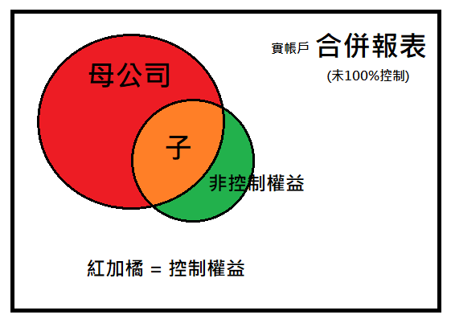

目錄： 
  <a href="#1">第三章</a> 
  <a href="#2">第四章</a> 
  <a href="#3">第五章</a> 

這篇文章將從第三章開始講述。

PS.因為期末考可能會累積考，甚至累積到下學期，所以我在這裡做一個總複習。

給自己的勉勵：必須要完全看懂才能夠考高分，加油！

 # 第三章 - 母公司權益法下的會計處理 

PS.這一章結都是以母公司的角度出發。

這一篇主要講述的章節為：當一家母公司收購一家子公司，使其母公司對子公司具有控制權時所需要做的分錄。而母公司所買入的價格，及為母公司的資產。以嚴謹的定義來說，母公司雖然擁有子公司，但對母公司來說，子公司就如同會產生經濟效益為母公司賺錢的<b>金融商品</b>罷了。

當母公司購買子公司這個資產時，我們會付出等價的利益來購買它，我們稱之為<b>移轉對價</b>。而買入的資產科目，我們以<b>投資子公司</b>計入資產科目。

科目示範

> 借：投資子公司 ＸＸＸ

> 貸： -- 現金　ＸＸＸ

> 貸： -- 普通股股本　ＸＸＸ

> 貸： -- 資本公積-普通股溢價　ＸＸＸ

> 貸： -- 機器設備  ＸＸＸ

當收購時，發生之所有成本及費用也必須紀錄。

範例：收購子公司發生成本5萬及給相關人士本公司2000股當作酬勞。

> 借：收購費用 80,000

> 貸： -- 現金　50,000

> 貸： -- 普通股股本　20,000

> 貸： -- 資本公積-普通股溢價　10,000 (設股價為15元)

接下來是辨識母公司的投資資產"投資子公司"的公允價值，以確認這項資產本身淨值(類似於成本)以及母公司願意多花錢買進的價值(類似利潤)，本身的淨值稱為<b>可辨認淨資產</b>。而多出來的價格稱為<b>商譽</b>。而子公司可辨認淨值加上商譽則為<b>淨資產</b>，若母公司買下子公司100%的權利。則<b>淨資產=移轉對價 </b>。若沒有買下所有的權利。則<b>淨資產=移轉對價 + 非控制權益 </b>。<b>非控制權益 </b>即為沒買下的部分，始為<b>權益類</b>科目，但只計入母子公司之<b>合併</b>財務報表之中。

  ## (補充)權益法之補充說明
<code>

    當母公司之投資資產，"投資子公司"產生獲利時，應在期末進行調整。例如子公司在今年獲利1萬元。則母公司也會因為這樣資產而獲得利益。

    分錄(假設母公司買下公司80%)：

    > 借：投資子公司  8,000

    > 貸： -- 投資收益　8,000

    對於母公司來說，子公司只是我商品的一部分，所以只要子公司賺錢了導致子公司資產增加，對我來說都是一種收益。

    然而，子公司宣布發放股利時，代表子公司要發錢給股東，本身資產會減少，對母公司來說"投資子公司"這項商品會減少它的價值，所以必須在發放股利時做沖銷分錄。
    
    分錄-子公司發放5千現金股利(假設母公司買下公司80%)：

    > 借：現金 4,000

    > 貸： -- 投資子公司　4,000
</code>

從這裡我們可以學習到子公司對母公司來說，只是一項"金融投資商品"而已，所以每一個處理的步驟都遵守IFRS9公報處理方式。

然而金融資產有一個很重要的一個環節，那就是必須以公允價值去衡量。可辨認淨資產也會隨著時間而有所改變，比如子公司存貨毀壞、子公司設備賣到市場的價格減少...等等等，都會間接的<b>導致母公司的"投資子公司"這項資產減少或增加。</b>因而未來勢必會對投資子公司這項科目的調整。

因此我們可以得出，當公允價值變動時，帳面金額與公允價值就會產生低估數或者高估數。便有了下面的公式。

<b>可辨認資產的公允價值 + 商譽 = 移轉對價 + 非控制權益</b>

<b>可辨認資產的公允價值 = 可辨認淨資產"帳面價值" + 帳面金額低估數 - 帳面金額高估數</b>

不管是高估或低估，都會影響母公司投資子公司的投資收益會有差異，因此我們必須以調整後的淨利為基礎，重新計算投資收益。

##  權益法的特殊投資問題

有些母公司會在期中時才收購子公司，這時我們必須利用以下的程序：

> (1) 確認<b>期初</b>的可辨認資產的帳面價值。

> (2) 期初至收購日的<b>淨利</b>，未來將轉換至母公司之<b>投資收益</b>。

PS 投資收益 = 子公司淨利 * 收購%數。

> (3) 期初至收購日所發放之<b>股利</b>

PS 母公司收到現金 = 子公司發放現金股利 * 收購%數
而子公司發放現金將會導致資產減少，進而減少母公司<b>投資子公司</b>，所以母公司必須認列投資子公司的減少。

> (4) 是否遇到<b>其他綜合損益</b>科目之攤銷。

# 第四章 - 淺談合併報表

第四章主要講解基本的合併報表需要注意哪些情況，以及收購日當下的分錄處理，切換至工作底稿時，需要注意到哪些分錄需要做調整，權益法下那些分錄不能被記錄在合併報表裡面。

## 基本觀念

### 期初實帳戶報表處理

在一開始講解合併報表時，我喜歡用統計學的圖示來做表達，在統計學我們學到一個觀念叫做聯集，來講述給大家看。

<!--  -->

當我們要開始合併報表時，所要達到的目標就是紅色的部分加上綠色的部分。然而，過程會有黃色的部分會重複，接下來大部分的章節都是在講述如何把多餘的黃色部分做刪除。

編制收購合併資產負債表的原則如下：

(1) 相對科目的沖銷：前面所說，投資子公司對母公司來說是一種金融商品，但合併時我們要把它當作是一家普通的公司來做合併，因此母公司只要把它當作金融商品的全部都要沖銷掉。如：<b>投資子公司收益</b>、<b>投資子公司</b>、<b>其他綜合損益 - 子公司</b>、<b>股本 - 子公司</b>、<b>保留盈餘 - 子公司</b>......等等的部分都要做沖銷。

(2) 非相對科目合併：不衝突的部分，紅色 + 綠色直接相加就可以了。

(3) 整個合併報表需要留下兩種內容：第一種是<b>控制權益(紅+綠-黃)</b>、另一種是<b>非控制權益</b>

可以拿P173的例題五做解說：

EX:

移轉對價為：120,000

收購日公允價值為： 35,000 + 65,000 = 100,000

公允價值 = 可辨認淨資產 = 100,000

非控制權益為可辨認淨資產的比例分額衡量 = 100,000 * 10% = 10,000

商譽 = 30,000

在合併時：

紅色和綠色為： 流動資產、不動產廠房設備、其他負債、商譽(因為剛收購，所以需要做調整分錄)。

以上內容直接相加。

黃色為：投資中英公司、子公司股本、子公司保留盈餘。

並新增科目：非控制權益，此為<b>權益類</b>科目，貸記新增。

以上內容要直接扣除，該如何扣除呢？直接沖銷科目即可，在借方的科目以貸方沖銷，貸方的科目以借方沖銷。

調整沖銷分錄如下：

    > 借：股本 - 中英公司 35,000

    > 借：保留盈餘 - 中英公司 65,000

    > 借：商譽 30,000

    > 貸： -- 投資中英公司　120,000

    > 貸： -- 非控制權益　10,000

從分錄我們就可以很清楚地了解到，當母子公司合併的時候，會有兩個地方是重複計算的(橘色加紅色的部分)。

第一個部分就是<b>投資子公司</b>，另一個部分便是
<b>子公司的權益(股本 + 保留盈餘)</b>。但兩者不一定會相等。因為會多出一個<b>商譽</b>或者<b>廉價購買利益</b>。最後，因為合併報表包含了控制權益和非控制權益，所以在補增一個<b>非控制權益</b>囉。

以上屬於收購後所紀錄之合併報表調整，保留盈餘的部分以當年度<b>1月1日</b>為主，原因為目前<b>虛帳戶</b>的部分還沒有關帳，所以接下來會針對期末12月31日的部分進行虛帳戶的處理與調整。

# 第五章 － 權益法下財務報表合併

這一章大部分的重點在前面的部分都已經敘述過，在這一章章節裡面主要是講權益法和不完全權益法的差別，但是我們現在只教權益法，所以這章節大部分都只要做題目，熟能生巧就可以囉。

大致上的合併報表步驟整理如下：

1. 先確定哪些部分是合併之後不該存在的項目？例如：母公司的投資子公司、投資收益。

2. 更正紕漏，錯誤之資訊。例如：後面的題目常常會忘記提列專利權(超會忘記)。

3. 沖銷未實現損益或已實現損益。例如：未攤銷的折舊費用、上面專利權的攤銷費用，或者未來順逆流貿易會使用到的未實現。

4. 沖銷投資收益、其他綜合權益，例如：子公司發放現金股利，幾乎全部都是跟母公司重複的收益，必須調整沖銷。

5. 沖銷期初的投資子公司帳戶跟子公司的權益類 - 股本、保留盈餘。期初非控制權益和未攤銷差額。

6. 分攤期初未攤銷差額，並進行攤銷調整。

7. 增列非控制權益，其他綜合損益。

8. 沖銷其他相對科目。

9. 計算合併報表數字，算出各科目餘額，完成工作底稿。

大概就這九個步驟，有些東西可以跳著做彈性處理。有些必須要按步驟，請自行融會貫通。

若想知道自己是否融會貫通？可以先完成後面例題第11題，此為綜合練習題。

  只要能夠讀通這一題，這學期已經讀完了70%，相信我 